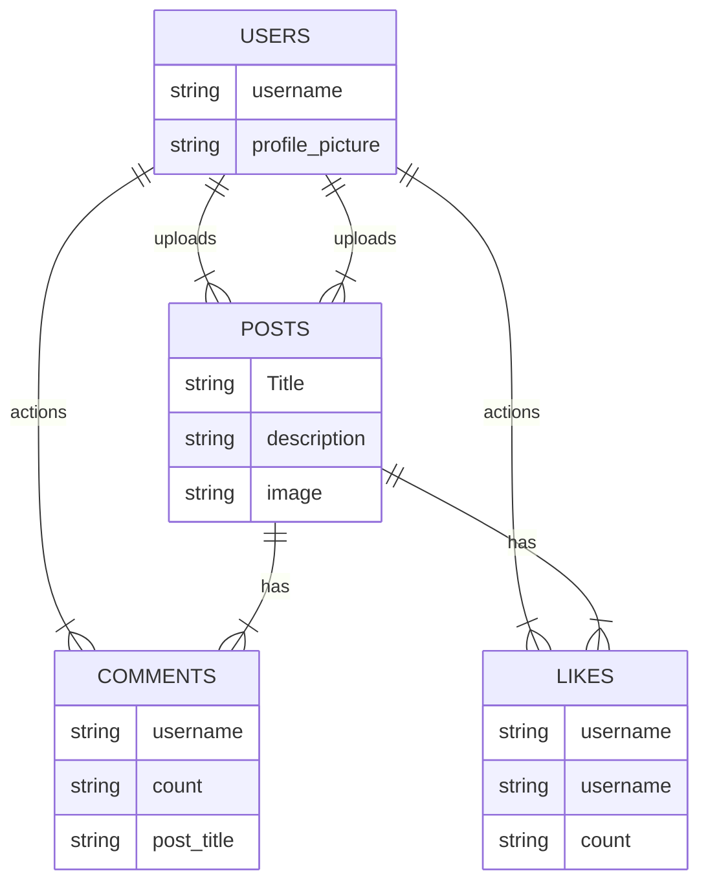

```mermaid
erDiagram
   USERS {
        string username
        string profile_picture
    }
    POSTS {
        string Title
        string description
        string image
    }
    COMMENTS{
        string username
        string count
        string post_title
    }
    LIKES{
        string username
        string username
        string count
    }
USERS||--|{ COMMENTS: actions
USERS||--|{ LIKES: actions
POSTS||--|{ COMMENTS: has
POSTS||--|{ LIKES: has
USERS||--|{ POSTS: uploads
USERS||--|{ POSTS: uploads
```

<!-- checked, completion receipt for exercise 1 & 2  -->
