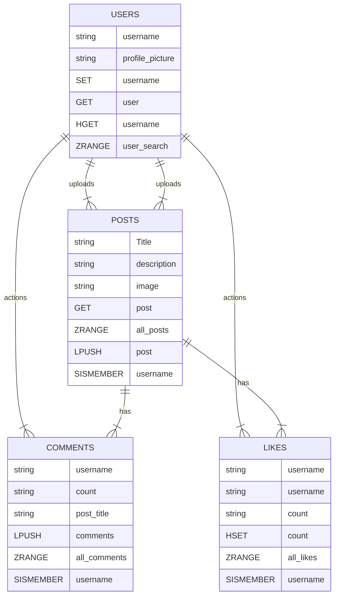

```mermaid
erDiagram
   USERS {
        string username
        string profile_picture
        SET username
        GET user
        HGET username
        ZRANGE user_search
    }
    POSTS {
        string Title
        string description
        string image
        GET post
        ZRANGE all_posts 
        LPUSH post
        SISMEMBER username
    }
    COMMENTS{
        string username
        string count
        string post_title
        LPUSH comments 
        ZRANGE all_comments
        SISMEMBER username
    }
    LIKES{
        string username
        string username
        string count
        HSET count
        ZRANGE all_likes
        SISMEMBER username
    }
USERS||--|{ COMMENTS: actions
USERS||--|{ LIKES: actions
POSTS||--|{ COMMENTS: has
POSTS||--|{ LIKES: has
USERS||--|{ POSTS: uploads
USERS||--|{ POSTS: uploads

```