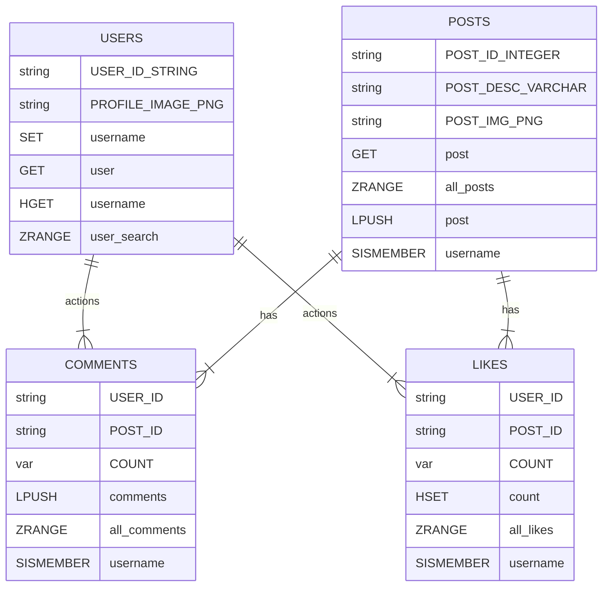

```mermaid
erDiagram
   USERS {
        string USER_ID_STRING
        string PROFILE_IMAGE_PNG
        SET username
        GET user
        HGET username
        ZRANGE user_search
    }
    POSTS {
        string POST_ID_INTEGER
        string POST_DESC_VARCHAR
        string POST_IMG_PNG
        GET post
        ZRANGE all_posts 
        LPUSH post
        SISMEMBER username
    }
    COMMENTS{
        string USER_ID
        string POST_ID
        var COUNT
        LPUSH comments 
        ZRANGE all_comments
        SISMEMBER username
    }
      LIKES{
        string USER_ID
        string POST_ID
        var COUNT
        HSET count
        ZRANGE all_likes
        SISMEMBER username
    }
USERS||--|{ COMMENTS: actions
USERS||--|{ LIKES: actions
POSTS||--|{ COMMENTS: has
POSTS||--|{ LIKES: has

```